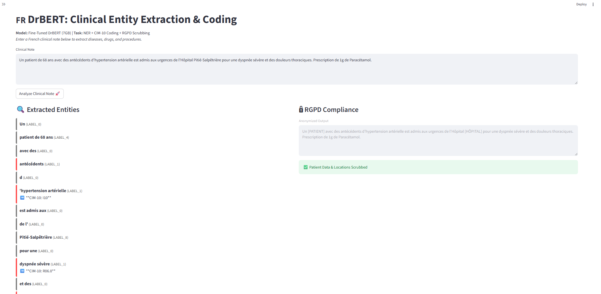

##  NLP Sante France (Clinical-Insight-Pipeline)

**Automated French Medical NER & Normalization System**

A professional NLP pipeline for extracting clinical entities from unstructured French medical text, mapping them to international standards **(UMLS/CIM-10)**, and ensuring **RGPD (GDPR)** compliance through automated de-identification.

---

### Project Overview
This project is an attempt to help doctors save time on administration coding the French health sector. This project demonstrates an end-to-end solution to:

* **Extract:** Identify critical medical entities (Disorders, Procedures, Drugs) using a fine-tuned DrBERT model.

* **Normalize:** Map colloquial French clinical terms to standardized codes (CIM-10/UMLS).

* **Protect:** Automatically mask patient identifiers to meet CNIL and RGPD requirements.

### Tech Stack
* **Language:** Python 3.11+

* **Models:** DrBERT(Sovereign French Biomedical LLM)

* **Dataset:** QUAERO French Medical Corpus (Gold Standard)

* **Libraries:** transformers, spacy, pandas, seqeval (for clinical metrics)

### Key Features
- **Clinical NER:** Extraction of 8 medical entity types **(Maladies, Procédures, Anatomie, etc.)**.
- **DrBERT Fine-Tuning:** Leveraging 7GB of French biomedical pre-training for high-precision extraction.
- **RGPD Compliance:** Automated masking of personal details for safe medical data handling.
- **Interoperability:** Preparation for mapping extracted terms to **UMLS** and **CIM-10** codes.
- **Streamlit UI:** An interactive dashboard for real-time entity visualization.

### Performance
The model was validated using **5-Fold Cross-Validation** to ensure robustness across different clinical contexts and medical document types. Unlike standard accuracy, we report **Strict Entity-Level F1-Scores**, ensuring that an entity is only marked "correct" if its type, start, and end are all perfect.


* **Evaluation Strategy:** 5-Fold Cross-Validation (Seqeval Strict)
* **Mean Strict F1-Score:** `0.4532`
* **Standard Deviation:** `± 0.0089` (Indicates high model stability)
* **Foundation Model:** DrBERT (NACHOS Corpus - 7GB of French Medical data)

### Demo
The system features an interactive **Streamlit** dashboard. Users can input raw clinical notes and visualize the pipeline's three core outputs: **NER Extraction**, **CIM-10 Coding**, and **RGPD Anonymization**.

> **demo.png**


### How to Use
Clone the repository and install the dependencies listed in the `requirements.txt` file:

```bash
git clone [https://github.com/Arshbeg/NLP-Sante-France.git](https://github.com/Arshbeg/NLP-Sante-France.git)
cd Clinical-Insight-Pipeline
pip install -r requirements.txt
```
Open and run all cells in clinical_**ner_pipeline.ipynb.**
The trained model will be saved automatically to the **./final_french_ner_model directory.**
Once the model is saved, run the Streamlit interface to test the pipeline with your own medical text: **streamlit run app.py**

---
